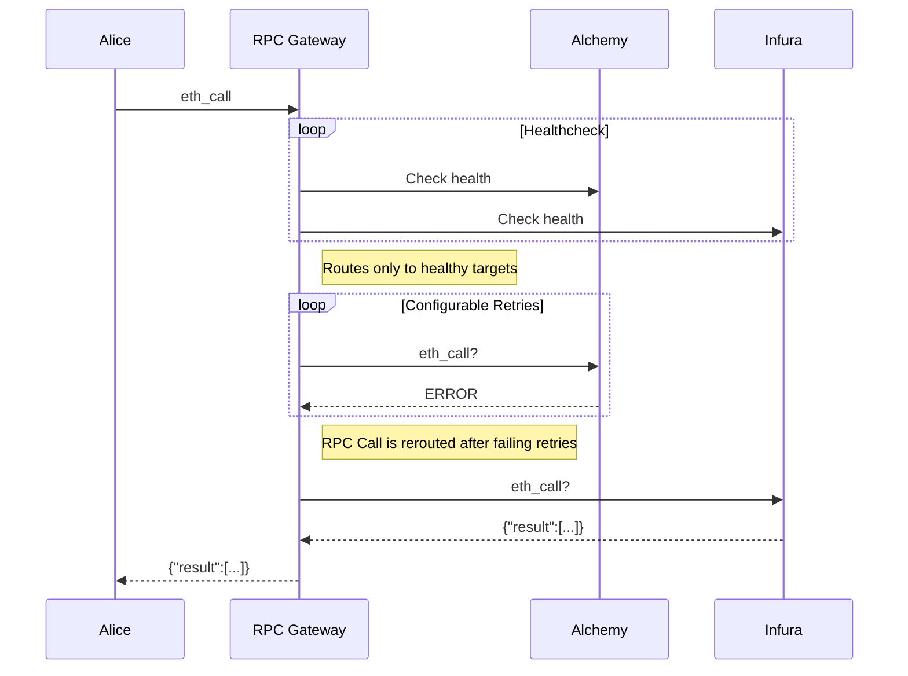

# RPC Gateway

A high-performance RPC gateway that provides load balancing and health checking for multiple RPC providers.

## Features

- Load balancing across multiple RPC providers
- Health checking with automatic failover
- Support for multiple chains
- Prometheus metrics
- Configurable timeouts and intervals

## Configuration

The gateway is configured using a YAML file. Here's an example configuration:

```yaml
port: 3000 # port for RPC gateway

metrics:
  port: 9010 # port for prometheus metrics, served on /metrics and /

proxies:
  - path: "eth" # directory path for the proxy (e.g. http://localhost:3000/eth)
    upstreamTimeout: "1s" # when is a request considered timed out
    healthChecks:
      interval: "12s" # how often to do healthchecks
      timeout: "1s" # when should the timeout occur and considered unhealthy
      blockDiffThreshold: 2 # how many blocks behind the max block number to taint
    targets:
      - name: "provider1"
        connection:
          http:
            url: "https://provider1.example.com"
      - name: "provider2"
        connection:
          http:
            url: "https://provider2.example.com"
```

### Configuration Parameters

- `port`: The port on which the RPC gateway will listen
- `metrics.port`: The port on which Prometheus metrics will be served
- `proxies`: List of proxy configurations for different chains
  - `path`: The URL path for this proxy (e.g., "eth" for Ethereum)
  - `upstreamTimeout`: How long to wait for upstream responses
  - `healthChecks`: Health check configuration
    - `interval`: How often to perform health checks
    - `timeout`: How long to wait for health check responses
    - `blockDiffThreshold`: Maximum allowed block difference between providers
  - `targets`: List of RPC providers
    - `name`: Provider identifier
    - `connection.http.url`: Provider's HTTP URL

## Health Checking

The gateway performs health checks on each RPC provider:

1. Block number check: Verifies the provider can return the latest block number
2. Gas left check: Verifies the provider can execute `eth_call` requests

A provider is marked as unhealthy if:
- Any health check fails
- The provider's block number is too far behind other providers
- The provider fails to respond within the configured timeout

A provider is marked as healthy again as soon as it passes a health check.

## Metrics

The gateway exposes Prometheus metrics at `/metrics`:

- `rpc_provider_info`: Information about each RPC provider
- `rpc_provider_status`: Current health status of each provider
- `rpc_provider_block_number`: Latest block number reported by each provider
- `rpc_provider_gas_left`: Gas left in each provider

## Building

```bash
go build -o rpc-gateway
```

## Running

```bash
./rpc-gateway -config config.yml
```

## License

MIT



## Development

Make sure the test pass
```console
go test -v ./...
```

To run the app locally
```console
# Set log level (optional, defaults to "warn")
export LOG_LEVEL=debug  # Available levels: debug, info, warn, error

go run . --config example_config.yml
```