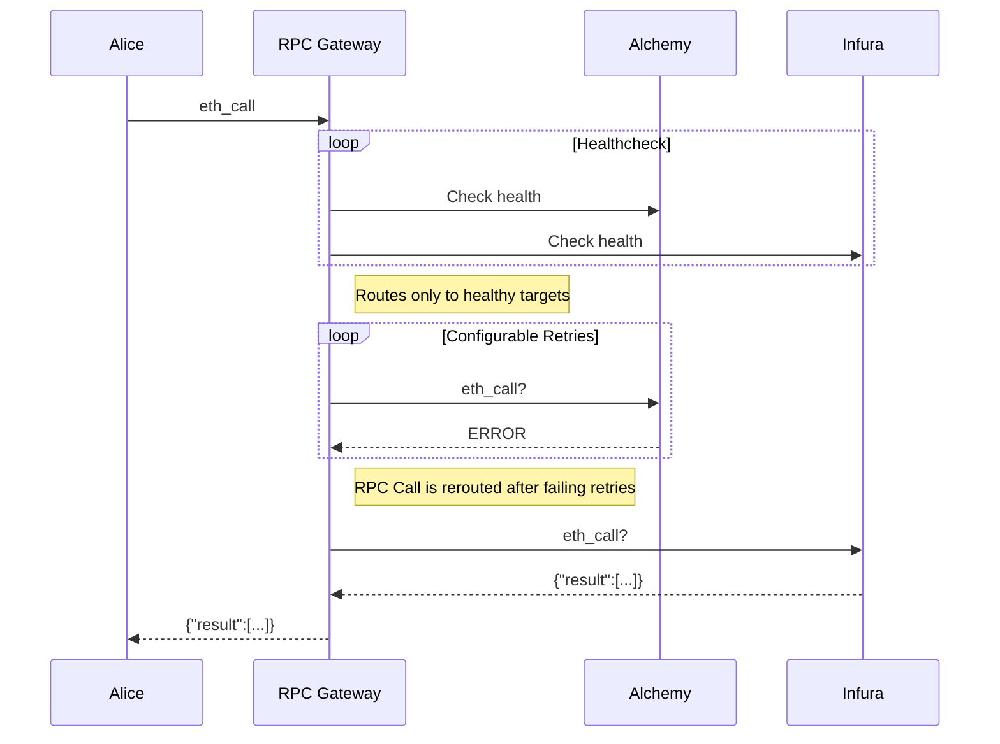

## RPC Gateway

The rpc-gateway is a failover proxy for node providers. When health checks
fail, the rpc-gateway automatically routes requests to a backup node provider.



## Development

Make sure the test pass
```console
go test -v ./...
```

To run the app locally
```console
# Set log level (optional, defaults to "warn")
export LOG_LEVEL=debug  # Available levels: debug, info, warn, error

go run . --config example_config.yml
```

## Configuration

```yaml
port: "3000" # port for RPC gateway

metrics:
  port: "9010" # port for prometheus metrics, served on /metrics and /

proxies:
  - path: "eth" # directory path for the proxy (e.g. http://localhost:3000/eth)
    upstreamTimeout: "1s" # when is a request considered timed out
    healthChecks:
      interval: "5s" # how often to do healthchecks
      timeout: "1s" # when should the timeout occur and considered unhealthy
      failureThreshold: 2 # how many failed checks until marked as unhealthy
      successThreshold: 1 # how many successes to be marked as healthy again
      blockDiffThreshold: 2 # maximum allowed block difference between providers
    targets: # the order here determines the failover order
      - name: "publicnode"
        connection:
          http:
            url: "https://ethereum.publicnode.com"
      - name: "Alchemy"
        connection:
          http:
            url: "https://alchemy.com/rpc/<apikey>"
```